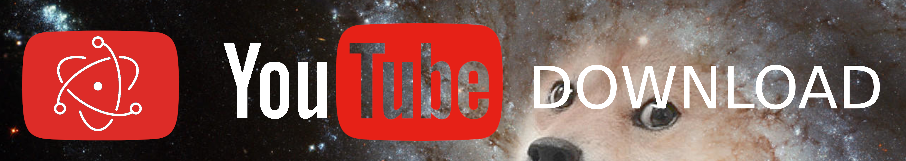
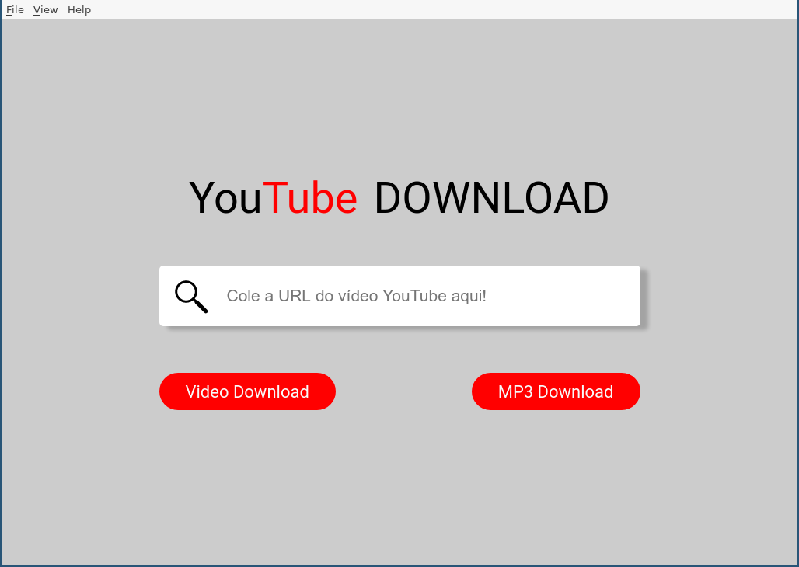

<br>

<p>
  Electron React Boilerplate uses <a href="https://electron.atom.io/">Electron</a>, <a href="https://facebook.github.io/react/">React</a>, <a href="https://github.com/reactjs/react-router">React Router</a>, <a href="https://webpack.js.org/">Webpack</a> and <a href="https://www.npmjs.com/package/react-refresh">React Fast Refresh</a>.
</p>

<br>

<div align="center">
  
</div>

<br />
## Install

First, clone the repo via git and install dependencies:

```bash
git clone https://github.com/inacio0196/youtube-download.git
cd youtube-download
yarn
```

## Starting Development

Start the app in the `dev` environment:

```bash
yarn start
```

## Packaging for Production

To package apps for the local platform:

```bash
yarn package
```
